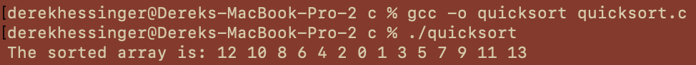

# Project 4
Derek Hessinger (partner: Sumira Naroola)  
Prof. Ying Li  
CS 333  
11/10/24

## Google Sites URL: https://sites.google.com/colby.edu/dereks-cs333-site/home?authuser=1

## Directory Tree

## Operating system and C compiler
OS: Apple Sonoma \
C compiler: Apple clang version 15.0.0 (clang-1500.3.9.4), Target: arm64-apple-darwin23.5.0, Thread model: posix

## Part 1

### Task 1
To compile and run the program:  
```
gcc -o quicksort quicksort.c  
./quicksort
```
There are no known bugs within the program.  
Output of the program:  


### Task 2
To compile and run the program:  
```
gcc -o factorial factorial.c  
./factorial
```
There are no known bugs within the program.  
The program demonstrates that types are preserved within functions. That is, setting calc as an integer pointer, then pointing it to the function factorial is valid, and allows the function to run and return an integer. Below, we see that when increasing the size of the number from 12 onwards, we reach overflow for the integer value, and the number returned from the program is incorrect for integers greater than 12.  
Output of the program:


### Task 3
To compile and run the program:  
```
gcc -o clltest clltest.c linkedlist.c
./clltest
```
There are no known bugs within the program.  
Output of the program:  


The freefunc is a necessary parameter for the ll_clear function because the linked list node may contain a pointer to dynamically allocated memory that needs to be freed before freeing the node itself. Thus only the caller knows the structure of the data stored in each node and how to properly free any associated resources. For instance, in the case of the linked list we use in this project, if one has a linked list of word counters, and the freefunc does not free the word array, then there will be a memory leak of the word array since it is not explicitly freed, even if the node is freed.

### Task 4
To compile and run the program:  
```
gcc -o wordcounter wordcounter.c
./wordcounter wordcountertest.txt
```
There are no known bugs within the program.  
Output of the program:  


a&b. To implement the case-insensitivity of the word counter, I created a function `clean_word` that takes in two char array pointers as an input, and casts each letter to a lowercase letter with the `tolower` function. The function also performs an `isalpha` check before trying to cast the char to lower case, to ensure that punctuation is ignored as well.   
c. To read the filename from the command line, I utilized the `fopen` function to make use of the standard I/O system for C. I also performed null checks to ensure that an argument is passed, and that the file actually exists.  
d. To print out the top 20 words in descending order, I added each of the words to an array as a wordcount struct that stored the word and their count, and used `qsort` to sort the words by their count, then printed out the first 20 words in the array.

## Part II

### Task 1
To compile and run the program:  
```
g++ -std=c++11 -o mergesort mergesort.cpp
./mergesort
```
There are no known bugs within the program.    
For this task, I implemented mergesort in c++. To do so, I made use of templates to allow for arbitrary types and comparison functions to be used.
Output of the program:  


### Task 2
To compile and run the program:  
```
g++ -o clltest clltest.cpp linkedlist.cpp
./clltest
```
There are no known bugs within the program.    
Output of the program:  


### Task 3
(See google site: https://sites.google.com/colby.edu/dereks-cs333-site/home?authuser=1)

### Task 4
To compile and run the program:  
```
g++ -o wordcounter wordcounter.cpp
./wordcounter wordcounter_test.txt
./mergesort
```
There are no known bugs within the program.     
Output of the program:


## Extensions
### Extension 1: Mergesort in C
For our first extension, we implemented mergesort in C. This required making use of temporary arrays to compare each half of
the array, and to merge the array back together. The implementation was similar in C++, but was made much easier in C++ due to vectors
which allow for dynamic array sizes. 

### Extension 2: Quicksort in OCaml
For our second extension, we implemented quicksort in OCaml.

### Extension 3: LinkedList in OCaml
For our third extension, we implemented a linked list in OCaml.
